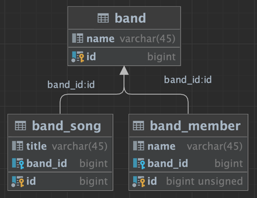

# Can or Cannot multiple FETCH JOIN

### 필요한 배경 지식
- FETCH JOIN: 연관된 엔티티를 하나의 쿼리로 함께 조회하는 것
- Bag: 순서가 존재하지 않으며 중복을 허용하는 Collection 

### MultipleBagFetchException 원인
> Cartesian 곱의 결과인 중복으로 인해 MultipleBagFetchException을 발생시킴
1. JPA에서 2개 이상의 연관 엔티티를 동시에 fetch
2. 3개 이상의 테이블 JOIN
3. 카티션 곱 야기
4. 무의믜한 중복 발생
5. Hibernate에서 원천 차단 (2개 이상의 Bag을 동시에 fetch하는 행위를 원천 차단)
6. Hibernate MultipleBagFetchException 발생

## Scenario
- 밴드(Band)는 여러 명의 멤버(Member)를 가질 수 있고, 여러 개의 곡(Song)을 가질 수 있음
- 모든 밴드에 대해 밴드에 연관된 멤버와 곡을 조회하고 싶음
- 조회하는 과정에서 2개의 FETCH JOIN을 사용하였고 MultipleBagFetchException 발생함

## Solution

### 1. Set 사용
- Bag의 수를 1개 이하로 하기 위해 Set 타입으로 변경
- 문제점
  - Set으로 정의된 Collection만 중복 제거됨
  - Set은 순서가 존재하지 않기 때문에 순서가 존재하게 데이터를 매핑할 수 없음

### 2. List 사용
- Bag의 수를 1개 이하로 하기 위해 List 타입으로 변경
- Bag은 순서가 없기 때문에 순서를 지정하여 List로 정의할 수 있음
- 문제점
  - List로 정의된 Collection만 중복 제거됨
  - List로 정의하기 위한 순서 Column이 존재해야 함

### 3. BatchSize 사용

### 4. 다중 쿼리 사용 - 가장 이상적인 솔루션

## Reference
- https://www.youtube.com/watch?v=mVOF6mY8JFA
- https://www.baeldung.com/java-hibernate-multiplebagfetchexception
- https://velog.io/@antcode97/Fetch-Join%EC%9D%98-%ED%95%9C%EA%B3%84